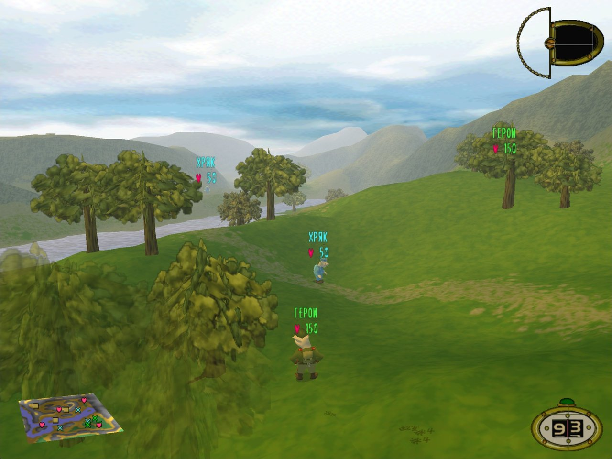
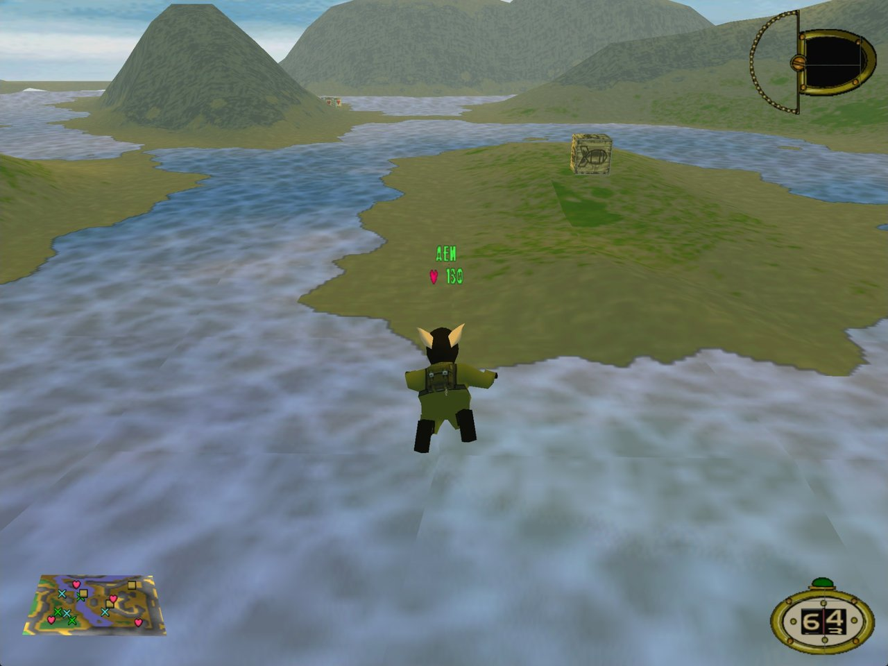
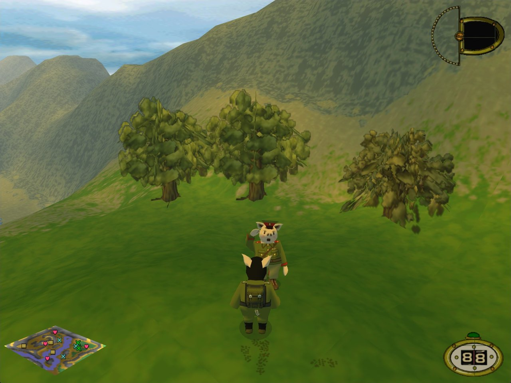
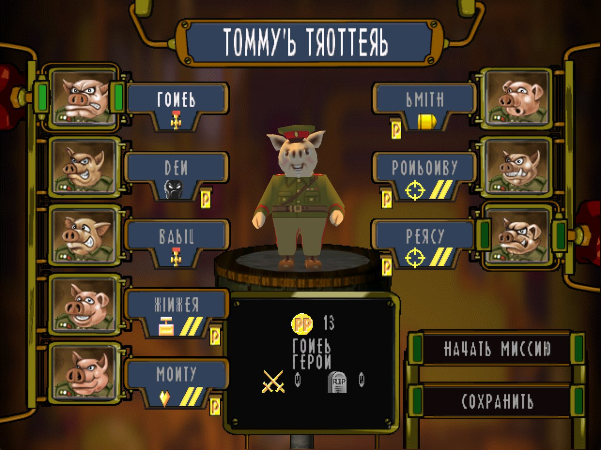

# Hogs of War Fix for Windows 10 and 11

**English** · [Русский](README.ru.md)

[](https://github.com/accidev/hogs-of-war-fix/actions/workflows/build.yml)
[](https://github.com/accidev/hogs-of-war-fix/releases/latest)

[Hogs of War](https://store.steampowered.com/app/389900/Hogs_of_War/) is a turn-based tactics game with pigs, made in 2000 by Gremlin Interactive and Infogrames. It is a PlayStation 1 classic that also came out on Windows. The Steam version of the Windows game does not start on Windows 10 and 11, and while it runs, it disables every other window on the desktop. This fan fix makes the game start and play well: in a big window or borderless fullscreen, on a new Direct3D 11 renderer, with music, camera zoom and a usable gamepad.

[](https://github.com/accidev/hogs-of-war-fix/releases/latest/download/HogsFix.zip)
[](https://youtu.be/oBo27HB4x_4)

<p align="center">
  
</p>
<p align="center">
  
  
  
</p>

## What you get

- **The game starts.** Its CD music library hung the Windows 10/11 DLL loader, so the game window never opened. A current build of ogg-winmm replaces it.
- **The desktop keeps working.** The original disabled all other windows until you quit through its menu, so after Alt+Tab or a crash the desktop stayed dead. Now the game leaves other windows alone.
- **A new renderer.** The game's DirectDraw 7 and Direct3D 7 calls run on Direct3D 11. There is no display mode switch, transparency is correct and the ground no longer vanishes in stripes. Each frame is rendered at a multiple of the game resolution and scaled down to the window, so edges are smooth.
- **A big window or borderless fullscreen.** The window opens as large as the screen allows and keeps 4:3. You can resize or maximize it, and Alt+Tab is safe.
- **More resolutions:** 1280×960, 1600×1200 and 1920×1440, in addition to the original 640×480 to 1024×768.
- **Camera zoom** with the mouse wheel or Numpad + and −.
- **A usable gamepad.** The stick dead zone is 15 % instead of 50 %, so the stick reacts over its whole travel.
- **Straight to the title screen.** There is no resolution dialog and no intro videos. You can turn both back on.
- **Music** from `MUSIC\TrackNN.ogg`. The in-game music volume no longer changes the game's volume in the Windows mixer.

## Install

You need Hogs of War from Steam (version 1.2) on Windows 10 or 11.

1. Download **[HogsFix.zip](https://github.com/accidev/hogs-of-war-fix/releases/latest/download/HogsFix.zip)**.
2. Open the game folder: in Steam, right-click Hogs of War → **Manage** → **Browse local files**.
3. Extract the zip into that folder. A `HogsFix` folder appears next to `warhogs_.exe`.
4. Open `HogsFix` and double-click **`patch.cmd`**. Wait until it says **Done**.
5. Start the game from Steam as usual.

The [install video](https://youtu.be/oBo27HB4x_4) shows all of this on a fresh copy of the game from Steam.

Good to know:

- Windows can warn you that `patch.cmd` came from the internet. Choose **Run**, or **More info** → **Run anyway**.
- The patcher checks everything before it changes anything. It keeps the original files as `warhogs_.exe.orig` and `winmm.dll.orig`.
- **Update:** extract the new zip over the old `HogsFix` folder and run `patch.cmd` again. Your settings in `hogs.ini` are kept.
- **Uninstall:** double-click `HogsFix\uninstall.cmd`. It puts the original files back and removes the fix with its settings.

## Controls

| Key | Action |
|---|---|
| Mouse wheel, Numpad + and − | Camera closer or farther, 50 to 200 % |
| Shift, held while the game starts | Resolution and detail dialog |
| F11 | 10 promotion points, if the cheat is on (see below) |

## Settings

The settings are in `hogs.ini` in the game folder. Restart the game after you change them.

| Setting | Default | What it does |
|---|---|---|
| `[Display] Windowed` | `1` | 1 = window. 0 = the original fullscreen mode, which the new renderer does not support |
| `[Display] Resizable` | `1` | The window can be resized and maximized |
| `[Display] Borderless` | `0` | 1 = a borderless window over the whole monitor, like fullscreen |
| `[Startup] SkipLauncher` | `1` | Start with the resolution chosen last time. Hold Shift at start to choose again |
| `[Startup] SkipIntro` | `1` | No logos and intro videos at start |
| `[Gamepad] Deadzone` | `15` | Stick dead zone in percent of its travel. The original game used 50 |
| `[Render] Scale` | `0` | Render at game resolution × Scale. 0 = enough to cover the monitor |
| `[Render] VSync` | `1` | Wait for the monitor refresh |

The interface is drawn in pixels, so it gets smaller at the high resolutions.

**Cheat.** Add these lines to `hogs.ini`. Then F11 gives the team on screen 10 promotion points (PP), up to 999.

```ini
[Cheats]
PromotionPoints=1
```

## Troubleshooting

- **No music or sound.** Open the Windows volume mixer and raise Hogs of War. The original game changed its own volume there together with the music volume, and it could leave it at 0. The fix stops this, but a 0 that was saved earlier stays.
- **"Unknown warhogs_.exe".** Only the Steam version 1.2 is supported. If another tool changed the exe, verify the game files in Steam (Properties → Installed Files → Verify integrity of game files) and run `patch.cmd` again.
- **"Hogs of War is running".** Close the game, then run `patch.cmd` again.
- **The game does not start or crashes.** Open an [issue](https://github.com/accidev/hogs-of-war-fix/issues) and attach `hogs.log` and `hogsdraw.log` from the game folder.

## How it works

| File in the game folder | Role |
|---|---|
| `warhogs_.exe` | Patched by `patch.cmd`. 325 calls that went through the LaserLock copy protection (`wh32lib.dll`) now call Windows directly, and the game loads `hogs.dll` in its place |
| `hogs.dll` | Fixes applied in memory when the game starts: windows, start-up, camera, gamepad, music volume and the game's renderer `_d3d.dll`. Each fix checks the original bytes first. Log: `hogs.log` |
| `ddraw.dll` | hogsdraw, the game's DirectDraw 7 and Direct3D 7 on Direct3D 11. Log: `hogsdraw.log` |
| `winmm.dll`, `winmm.ini` | [ogg-winmm](https://github.com/ayuanx/ogg-winmm) by ayuanx (GPL-2.0): CD music from OGG files |
| `hogs.ini` | Settings |

This repository contains no game files. The patcher changes your own copy of the game.

## Building from source

You need Visual Studio 2022 or later with C++, CMake and PowerShell 7.

```powershell
pwsh tools/make_release.ps1    # builds dist/HogsFix and dist/HogsFix.zip
```

GitHub Actions builds the same zip on every push, and a `v*` tag publishes it as a release. Developer notes are in [docs/DEVELOPMENT.md](docs/DEVELOPMENT.md). The technical log and the renderer analysis are in Russian: [docs/WORKLOG.md](docs/WORKLOG.md), [docs/renderer/](docs/renderer/).

## Roadmap

- 16:9 widescreen that shows more of the battlefield, not a stretched picture.
- Long term: decompile the game and build it as a native 64-bit program.

The task list is in [docs/TODO.md](docs/TODO.md) (in Russian).

## Credits and license

- The code of this fix is under the [MIT license](LICENSE).
- [ogg-winmm](https://github.com/ayuanx/ogg-winmm) by ayuanx plays the CD music. It is under GPL-2.0, and the release package includes its license.
- Hogs of War and its screenshots belong to the game's rights holders. This is an unofficial fan project.
